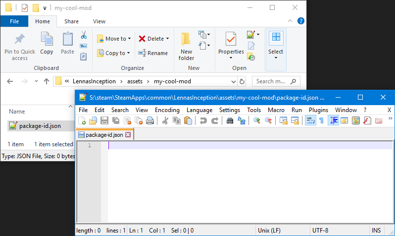
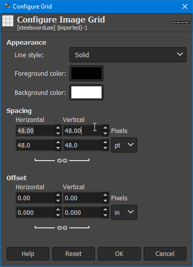
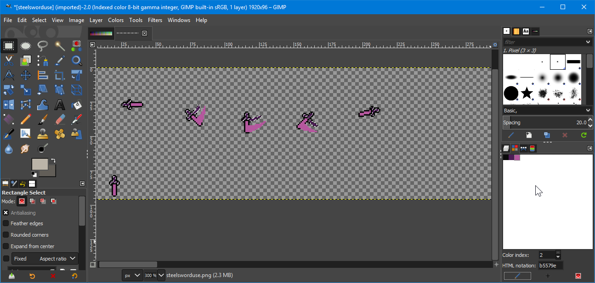
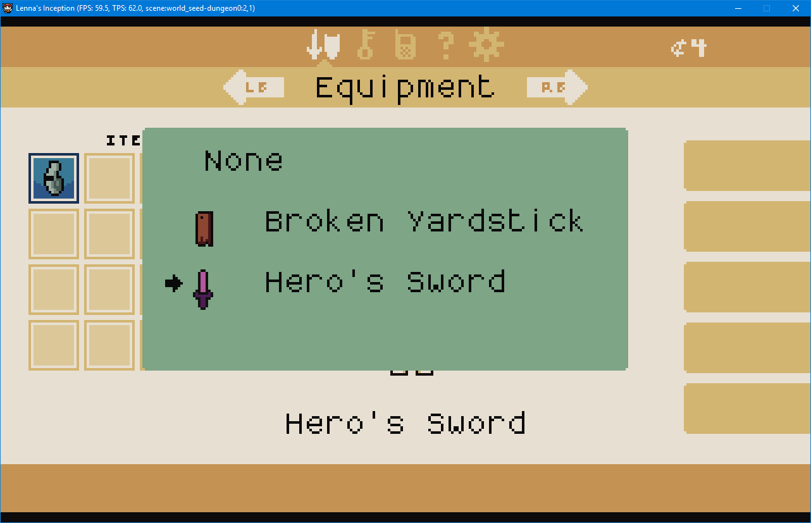

# Lenna's Inception Modding Guide

This guide will cover all the steps needed to get started creating mods for _Lenna's Inception_. If you are experienced with modding, you can skip to [Creating Your Mod])(#creating-your-mod).


## Installing Tools

If this is your first time creating a mod for a game, I recommend having these tools:

* [Notepad++](https://notepad-plus-plus.org/) - a free text editor that handles complicated text formats:
  
  > Getting the latest version of Notepad++ from `notepad-plus-plus.org`

* [7-Zip](https://7-zip.org/download.html) - a file archiver and extractor tool making it easier to extract game files and package mods:
  
  > Getting the latest version of 7-Zip from `7-zip.org`

* [GIMP](https://www.gimp.org/downloads/) - a graphical image manipulation program -- for handling game sprites with transparency
  
  > Getting the latest version of GIMP from `gimp.org`

## Viewing Local Files

In order to get started modding Lenna's Inception, you'll need to view your local files:

> right-click "Lenna's Inception" => manage => Browse local files

If you got the game from the `itch.io` launcher, you can:

> right-click "Lenna's Inception" => Manage

If you downloaded the game files from `itch.io` directly, open up where you extracted them to instead.

You can now view your local game files:

> The _Lenna's Inception_ install folder

To get an idea of what game files contain and what we can do with our mods, we should go back to the `assets` folder and extract `lennasinception.jar`:


> Extracting `lennasinception.jar` with 7zip to its own folder.

When you extract files this way, sometimes the code files included in the jar will not extract cleanly, and you may see an alert like this:


> Problems extracting files from a jar

In this case just select `Auto Rename`, since we are not doing a mod that will use scripts or code, we don't need to care if these files are correct. We will go over creating scripts and other things later on in a more advanced tutorial.

If we leave the files where they are, they will create a problem next time we start the game. We should create a new folder next to the `assets` folder named `extracted` and move the new `lennasinception` folder there. When we're done it should look like this:


> The extracted base game files are in their own folder where they can't be seen when running the game.

Now we can see the files:


> All the main game files are on display.

From here we can explore the base game and its files.

## Creating Your Mod

Enter the `assets` folder and create a `New folder` named `my-cool-mod`:

> A new folder with the name `my-cool-mod`

Now open this directory and create a new file named `package-id.json` and open it up, it should look like this:

> A newly created `package-id.json`

### Your Package ID

Now copy and paste this template into your new `package-id.json` so you can begin filling it out:

```json
{
    "id": "",
    "name": "",
    "description": "",

    "author": "",
    "authorEmail": "",
    "authorWebsite": "",

    "versionNumber": "1.0.0"
}
```

For now we only need this bit of information:

* **id**: This should be unique between all mods, I recommend naming it like the folder your mod is in, and we can change it later before we're done. For now we can use `my-mod-id`.


> Giving our mod an `id` in the `package-id.json`

### Making Mod Files

Now we are going to focus on populating our mod with content. To begin, we're going to duplicate the files for the sword and change its color.

If we navigate to `lennasinception/sprites/items` we can find that there are images that correspond with the `STEEL_SWORD` item in-game.


> All the files for the steel sword.

Inside of our mod folder we created earlier, we're going to recreate the directory structure that coresponds with these files, then we are going to paste a copy of them into our mod:


> Now we have a copy of the swords to use.

If we open up `steelsworduse.json` we can see the configuration for the sprites themselves:


> The configuration of a steel sword.

By looking at the configuration, we can see three major things:

* **width**/**height**: these two properties tell us the dimensions of each frame of the sword's animations.
* **directional**: because this is true, we can tell that the file will contain graphics for the sword facing every direction, meaning it is 4 times larger
* **frames**: with this information we can tell how many sprites are in each row of the image

We can ignore the properties for `drawOffset` and `dialogueDrawOffset` for now.

Now if we open `steelsworduse.png` in an editor we can see the sprites:


> The sprites for the steel sword in multiple directions.

(Note: I have the toolbars disabled because the image is so large, your window might look slightly different.) Since we know the width/height from the sprite's json, we can set the grid for the file:

1) Travel to `Image` > `Configure Grid...`
  

2) Type in the numbers from the `.json` file then hit `OK`
  horizontal = width
  vertical = height
  

3) Travel to `View` > `Show Grid` to enable the grid.
  

If you did everything right, you should see this:


> The swords with the grid visible.

If we refer back to the sword's `.json` file, we can see how the other information for **directional** and **frames** comes into play:


> Directional segments and frames indexed.

All **directional** sprites are 4 times larger than a regular sprite because they contain graphics for each of the four cardinal direction, in order: **south**, **west**, **north**, **east** -- in the game data you might see these referred to as just **"s"**, **"w"**, **"n"**, **"e"**. If you're unlucky you might also see **"o"** for **orthogonal**, or **oh no, it's broken**.

We can also see that the row marked with **0** has 5 frames of animation exactly like the `.json` file mentioned, and same with row **1** having just 1 frame. Every row in an image is going to either represent its own unique graphic or it will be an animation all by itself. Just remember that those offset values applies to everything in the current image, so if you should only be putting similar sized things on the same sheet anyway.

The image itself has room for 10 frames for each direction, but right now we're not using them. The engine knows to ignore these because we told it how big each frame of animation is (48x48) so it can tell from the image resolution that it has up to 40x2 frames in it. It also knows that because it's directional, each direction only gets 10x2 frames. The only reason we have to specify how long our animation is, is because multiple rows have different durations -- and making the image large enough might make some frames appear blank.

In order to fit with the base game style, we can open up the file `lennasinception/palette.png` and use colors from it when replacing colors in our sword:


> Selecting colors for our sword.

Here I have picked out a pink and a purple color with the _Color Picker Tool_. We can now recolor the base swords by converting the image to indexed:

1. Going to `Image` > `Mode` > `Indexed`
  
2. Typing `4` into the box (this sprite only has 3 colors excluding transparency) and hitting `Convert`
  
3. Replacing the colors from the `Color Map` window:
  
4. Convert the image back to RGB from `Image` > `Mode` > `RGB`
  
5. Exporting the image via `File` > `Overwrite ...`
  

Now if we did everything right, we should be able to load up the game and see our changes once we get far enough:


> Lenna wielding a pink sword.

If we wanted to, we could zip up our mod right now and post it -- but we shouldn't, because we didn't completely replace the sword:


> The menu icon for the sword has not been altered.

This is because the file that the icon for the sword comes from is different, it comes from `swords.png` which we also copied into our folder. We could simply make the steel sword pink in that image too, but I don't think we should. If we look closely at the file:


> The icon file has multiple images in it.

We can see that many different weapons are here. If simply changed the steel sword in this file, then we would be at risk of creating a conflict with someone else's mod if they did something similar. For example, if someone wanted a mod to make the Broken Yardstick green. You might have caught on by now that the files from mods are being put on top of the base game files, fully replacing them.

### Preventing Mod Conflicts

If you imagine that in this illustration:

1) `dir1` is the base game files
2) `dir2` is a mod archive
3) `dir3` is the filesystem as the game sees it


> Illustration by [Nigel Brown, originally from windsock.io](https://windsock.io/the-overlay-filesystem/)

The files that exist both in `dir1` and `dir2` are replaced by different versions from `dir2`, for example `dir2/fruit/apple` replaces `dir1/fruit/apple` but leaves `dir1/fruit/grape` and `dir1/fruit/mango` undisturbed. An alternate explaination is available from the [PhysicsFS project page](https://icculus.org/physfs/)

When the game starts up, it can potentially read from several mods at once, repeatedly merging files ontop of the base game data -- so for the sake of the players we want to have as small an impact as possible. Fortunately for our use case, there is other data we can change to achieve the desired effect.

Let's first start by emancipating the steel sword from `swords.png` and saving it into its own file:


> We have created a 16x16 `pinksword.png` next to `swords.png` in our mod files.

We can now edit `swords.json` to remove all the extra rows and save it as `pinksword.json` next to the `pinksword.png` we just created.


> A new `pinksword.json` with only one **frames** entry, all other properties are kept the same from `swords.json`.

Inside `my-cool-mod/sprites/items` should now be these files:


> All the files in our items folder.

We can safely delete from our folder:

* `steelsworduse.json` because our mod does not add any new frames to the sword, or change its dimensions.
* `swords.json` because we will be using `pinksword.json` in its place.
* `swords.png` because we will be using `pinksword.png` in its place.

Now all that should remain:


> The only files we want left over.

If we look around in the base game files we might be able to find where `STEEL_SWORD` is used and see if we can narrow down where the icon for the sword is being set. I'll save us a little time and direct our attention towards `lennasinception/items/equipment.json`:


> Here, we can find the definition for nearly every inventory item in the game.

We can look through this file and see how the various items in the game are defined, and identify what we need to change. Let's jump to the `STEEL_SWORD`'s definition.


> The entry for the `STEEL_SWORD` in our equipment.

If we look carefully, we can see that there's a few entries for **sprite**. Let's look at the first one.

```json
"sprite": {
  "size": [0.5, 1.0],
  "sheet": "items/swords",
  "row": 1,
  "colors": ["0x000", "0x222", "0x444", "0x555"]
},
```

The **sheet** value defines the image it will use, and **row** defines the vertical position on the sheet. It is set to **"row": 1** but as we learned earlier, row 1 is the second row because it starts at 0.

So we have identified the data we want to change, but how do we modify it? If we make a new version of this file then we will end up overwriting all the data for all the equipment in the entire game. Fortunately, the engine supports [JSON Patches](http://jsonpatch.com/), so all we have to do is specify exactly what we're trying to change. I recommend reading this website to get an idea of what we're about to do.

To begin, let's start by creating the directory structure for this file by creating the folder `my-cool-mod/items` and then creating a text file named `equipment.json.patch`.


> The new file is in place.

When we open it up, copy this data into it to begin with:

```json
[
  {
    "op": "",
    "path": "",
    "value": ""
  }
]
```


> The starting data in place.

So in order to figure out how to modify or amend the game data, we have to figure out the [JSON Pointer](http://jsonpatch.com/#json-pointer) to our data. Let's look again at the base `equipment.json` file.


> We can see many important pieces of information that can lead us to the changes we need to make.

* **document/object root**: the file begins with a `{` and closes with a `}` because it is an object.
* **object property**: the first element in an object is a property, the value before the `:` is its `key` or `name`. As we can see, the key `categories` begins another object.
* **child object property**: inside the object began by `categories` exists a property called `equipment`.
* **array value** the value of the `equipment` property is an array, in this circumstance it is an array of objects.

So far, our `path` value for our operation would look like this: `/categories/equipment`

In order to be more specific, we have to find out which index the object that defines the `STEEL_SWORD` is at.  In `Notepad++` we can click the boxes with a dash in them to collapse segments and make it easier to find what we're looking for:


> An indicator we can fold some code.


> We have found the `STEEL_SWORD`

As of the time of writing this, the `STEEL_SWORD` is the 2nd array indice for this path. This is because we're counting from 0. That means our path is now: `/categories/equipment/2`

We can now narrow down our path further to the exact properties we wish to change, we know we want to change the **sheet** first: `/categories/equipment/2/sprite/sheet`


> The property value that is referenced by the path `/categories/equipment/2/sprite/sheet`.

In our patch we can specifiy our path now:


> A patch with a path.

If our patch file isn't highlighting like JSON for you, you can enable language highlighting by:


> Visiting `Language` > `J` > `JSON` to mark the file as JSON.

We can also declare our `op` as `replace` and our new `value` as `items/pinksword`.


> A complete patch operation.

Now we can go back and change the `row`, too.


> Specifying the row as well.

If we load up our mod in-game, we can see if these changes worked:


> Our new pink sword has a functional icon.

But since we can see other places where `steelsworduse` is referenced in the `STEEL_SWORD` equipment definition, let's change them all out:


> Now all the other swords and mods can use the original files without our modifications.

But since we did that, we have to go copy the `steelsworduse.json` back and rename it to `pinksworduse.json` in our mod files and then rename `steelsworduse.png` in our mod files to `pinksworduse.png`.


> Now all the other swords and mods can use the original files without our modifications.

The last thing we have to do before packing up our mod now is to add a test to our patch:


> A test prevents us from modifying data we didn't intend to.

Now, when the game tries to patch `equipment.json` with the `equipment.json.patch` from our mod, if for any reason `/categories/equipment/2` is no longer the `STEEL_SWORD` then our mod will fail to apply and create a warning in our application log so we know it broke if we see our sword is missing after we install some new mods:

* `~/.local/share/lennasinception/lennasinception.log` (linux/osx)
* `%APPDATA%\LennasInception\screenshots\lennasinception.log` (Windows)

### Packing Your Mod

After we verify that our mod works one last time in-game, let's go back over the `package-id.json` of the mod. We know exactly what our mod does now, it makes the steel sword pink. We should give our mod an obvious name and description so people know what to expect.

Since our mod is only using `8bit` graphics I like to add data denoting that with **"advancedGraphics": false** and **"mode": "8bit"**. At the time of writing this, this doesn't do anything. Maybe some day we can add graphics for multiple graphics modes in a single mod. For now, this will do. All together, your `package-id.json` should look like this:


> Your complete `package-id.json`

Now let's add an icon for our mod by taking the `pinksword.png` we created earlier and opening it up in GIMP:

1. Center the sword in the canvas.
2. Go to `Image` > `Scale Image...` and scale it up to 64x64px with `Interpolation` set to `None`.
3. Export this to the root of your mod folder as `mod-icon.png` (this isn't strictly necessary but it's nice to have a 64x64 size version before you create a 96x96 version, maybe it will be useful in the future)
  
   > The export path.
4. Scale the image again, but this time, up to 96x96px.
5. Export the image once again to the root of your mod folder as `icon.png`
6. Export the image one final time to the root of your mod folder as `icon.ico`

If you did everything correctly your mod folder root should look like this:


> The root of our mod folder.

The final step is to rename our folder to match our new mod ID after we found out what we wanted to make with our mod:


> Our mod in the assets folder.

Now we can go inside our mod folder and zip up its contents so we can share it with everyone:


> Zipping up our files.

Then we want to move the zip file into the `assets` folder by itself, and move the folder full of files we just zipped up somewhere else (like our `extracted` folder for now) so that we can test the game works after we packaged our mod up.


> The clean assets folder.

Just check one more time in-game:


> Our sword is still pink in-game, and the applicaiton icon changed indicating we made our icons correctly.

Now if you did all this, you should be ready to share your mods in the Discord or with your friends. Have fun!
