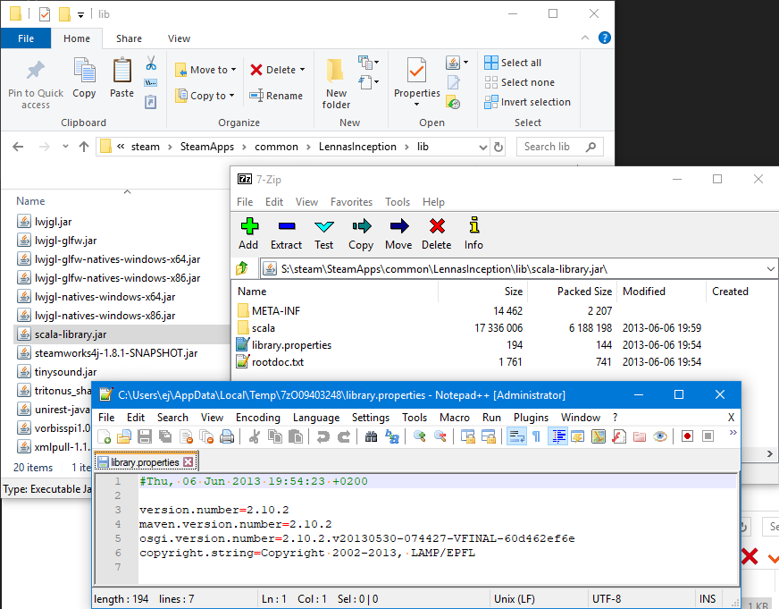
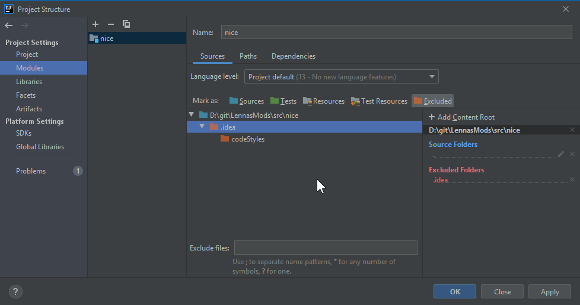
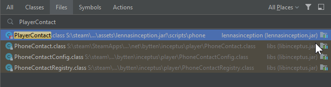

# Getting Started Scripting

Scripting cool mods is interesting and fun sounding, let's get into it.

## Paths

For the sake of convenience, I will be referring to a couple locations:

- **$gamedir**: the install path of the game, mine is `S:\steam\SteamApps\common\LennasInception` and yours will probably be different.
- **$userDirectory**: probably `%appdata%\LennasInception` or `~/.local/share/lennasinception/` unless you changed it in your `launch-config.json`

## Getting Version Info

There are a couple of important versions of things to know about, number one is our `java version`. We can view this by running `java.exe -version` (or just `java -version` for mac/linux users) from the `$gamedir/jre/bin` folder.


> Viewing the version of Java used for the game, which is `jre1.8.0_202` as of the time of writing this.

Then we can open the `$gamedir/lib/scala-library.jar` and view `library.properties` to find the scala version.


> Viewing the scala version used for the game, which is `2.10.2` as of the time of writing this.

***IMPORTANT: If you see different version numbers other than the ones in the pictures when you perform these steps, then notify @EntranceJew and use those versions instead.***

### Downloading Our Dependencies

Now we have all the information we need to get the [correct version of the Java JDK](https://github.com/frekele/oracle-java/releases/tag/8u202-b08), I recommend `jdk-8u202-windows-x64.exe` if you are on Windows 64 Bit. The automatic installer should do everything by itself so just click through it.

We can also do the same with Scala [by finding the correct zip version of Scala](https://www.scala-lang.org/download/2.10.2.html), I recommend `scala-2.10.2.zip` or the corresponding archive version for your platform. To double check, verify that `compiler.properties` inside `scala-2.10.2/lib/scala-compiler.jar` from the zip you just downloaded has the same version string as `library.properties` inside `$gamedir/lib/scala-library.jar`.

I recommend extracting from `scala-2.10.2/lib`:

- `scala-reflect.jar`
- `scala-compiler.jar`

And placing them inside `$gamedir/lib` next to `scala-library.jar`.

Our last dependency is [Scala continuations plugin jar, which we can get from Maven](https://repo1.maven.org/maven2/org/scala-lang/plugins/continuations/2.10.2/), if you can't find it on the page, you can try [viewing all](https://repo1.maven.org/maven2/org/scala-lang/plugins/continuations/2.10.2/) and selecting `continuations-2.10.jar`. Once we have that, we will put it in our `$gamedir/lib` folder as well.

We now have all the dependencies we need to begin creating scripting mods.


> Your `$gamedir/lib` folder should look like this now.

## Prepare Our Environment

Now that we have all the required files downloaded and installed, we can begin creating our mod.

For this tutorial we're going to go in with the express intent of creating a scripting mod so we can add a new telephone contact.

I recommend you create a folder outside of your `$gamedir` for this, for keeping all the mods you're working on in one place.

I'm going to create a folder named after our new mod `nice` which we will fill out the `package-id.json` info for:


> An empty mod.

Next, I'm going to launch `IntelliJ IDEA` and create a new project.


> Opening IntelliJ IDEA.

The first time we run IDEA we may be asked which plugins we would like. We should install the `Scala` plugin.


> Adding Scala support.

You can add whichever plugins you feel like, these are all the ones I got, but I will only be using the `Scala` plugin for this guide.


> Whatever suits your fancy.

Then we can now open the folder we created earlier for our mod:


> Open a directory.

After it is done setting up our workspace should look like this:

> A fresh start.

From here we can hit **Ctrl+Shift+Alt+S** to open up our project settings:


> The project settings in IDEA.

We're going to select an SDK by picking `New...` and selecting `JDK` from the dropdown that appears. A file select dialog should appear with existing JDK paths selected. You want to select `C:\Program Files\Java\jdk1.8.0_202` or your equivalent JDK install path on other platforms.

You will also want to supply a **Project compiler output** folder just so that built files aren't put inside our sources folder. If you created a directory structure similar to mine, then going up a directory and creating `_junk/industrial_waste` (resolved to `D:\git\LennasMods\_junk\industrial_waste`) will work.


> Complete project settings.

Next we will fill out the **Libraries** tab, first by adding the **Scala SDK**:


> Add a scala SDK

In the window that shows up, click browse and point it at `$gamedir/lib`.


> Selecting the `lib` folder.

A window will show up, you can just hit OK.


> Sounds good to me.

Now your **Libraries** tab will look like this:


> Added Scala SDK

Now we can add the **Java** libraries:


> Similar to before.

Select everything from `$gamedir/lib` EXCEPT `continuations-*.jar` and `scala-*.jar`:


> Selecting lots of jars.

Next we're going to add another **Java** library, and we'll be adding `$gamedir/assets/lennasinception.jar`


> Base game content added.

Do it again for `advance.jar`, but this time we'll be prompted how we want to add it, select `Jar Directory` and hit OK.


> Selecting how we want to add a code-less jar.

Now we set up the **Modules**:


> A plain module setup.

The key things we did were:

- Select the root folder (`nice`), mark it as `Sources`.
- Select the `.idea` folder, mark it as `Excluded`.

Ensure that our **Language level** is our project default. On the **Dependencies** tab ensure the **Module SDK** is set to `Project SDK`.


> Module SDK is correct.

And lastly we can do the **Artifacts**, beginning by adding a new empty JAR:


> A new empty JAR.

Create a `META-INF/MANIFEST.MF` if you're prompted.

Rename the artifact to match our mod ID `nice`, then from the **Available Elements** drag `'nice' compile output` into `nice.jar`

Then set the **Output directory** to be `$gamedir/assets` so we can test our mod faster.


> A complete artifact screen.

Now we have finished setting up the project structure.

We still have some project settings (**Ctrl+Alt+S**) to change.

The things we'll be doing are:

- Changing **Compile order** to be `Java then Scala`.
- Checking the box on for **Explain type errors**
- Checking the box on for **Enable continuations**
- Adding a **Compiler plugin** from `$gamedir/lib/continuations-2.10.2.jar`


> `Build, Execution, Deployment > Compiler > Scala Compiler` when completed

The last thing we'll want to do is make it so we have an easy way to run and test the game:


> Configuring a quick launch for the game.

The main things we've done here are:

- **Name** the tool `lennasinception`.
- Set the **Description** to `Test the game.`
- Set the **Program** to be `$gamedir/lennasinception.exe` or your corresponding entry point on other platforms.
- The **Working directory** should automatically populate by itself.
- Putting in the **Arguments**:
  - `-newgame` so that we instantly load into the game. If you would rather load an existing save file then you can omit this option or create a different tool without it. You can read more about [cheats](cheats.md) and [exgen](exgen.md) options to test your game faster.
  - `-DloadMods=true` so that we can force the game to load mods in case we disable it in `launch-config.json` for testing.
  - `-DdevMode=true` enable dev mode only when we're running the game from IDEA so we can play the challenge seeds without forgetting to change our `launch-config.json`.
  - `"-Dtitle=[DEBUG] Lenna's Inception"` so that we can tell we're running the game in debug mode at a glance.

If you would like to override more settings, look at [launch args](launch_args.md) to find out other settings, such as enabling logging filters.

## Making Our Mod

After what seems like a lot of setup, we can now begin actually creating files for our mod.

But first, we have to find out how the game sets up telephone files. We can explore our libraries and the `lennasinception.jar` to find out more, here we can see there's a `telephone` folder:


> A folder full of JSON files.

If we look through some of the files we can see they all have a similar format, and they all have a `script` property.


> The `player.json`

If we hit **Ctrl+Shift+N** we can type in the class name `PlayerContact` and see if we can locate it:


> Open PlayerContact.class

We can open the Scala class and see its definitions but not the source until we hit **Decompile to Java**:


> A class with only signatures.

After decompiling the class, we get some pretty messy code out:


> Technically complete Java code, technically.

Now we're going to prompt IDEA to turn this Java back to Scala by:

1. Pressing **Ctrl+A** to select all.
2. Pressing **Ctrl+C** to copy it.
3. Click anywhere to deselect it all.
4. We can then press **Ctrl+Shift+A** to open the actions menu.
5. Then type `New Scratch File`, hit enter.
6. Type just `Scala` and hit enter again.
7. Hit **Ctrl+V** to paste all the Java code into your new Scala pad.
8. Hit **OK** on the prompt that will appear to convert code.


> Great job.

Now we get more readable code, depending on whether or not you are fluent in miscompiled Scala:


> Fewer lines, fewer problems.

We can clean this up further by scrolling all the way out and selecting everything before the class declaration and remove the `@ScalaSignature`.


> Get out of here with that.

Now all our code fits on one screen.


> Still a bit of a mess.

We can infer from the type signature before we decompiled the code to Java that the code is actually a lot simpler than it seems, the important thing is that we saw that the main function being used is `showText("some information")` and that we somehow have to return a boolean.


> Brief code, brief problems.

The one piece of outside knowledge, we already set up scala to use continuations. In order to modify this code to use continuations we need to import it and modify the return type. (That's probably what it's called. I don't know. I don't speak Scala.)


> Fixed it probably.

Or, for convenience:

```scala
package scripts.phone

import scala.util.continuations._

class PlayerContact extends PhoneContactScript {
  override def call(): Boolean @cps[Unit] = {
    showText("Nice.")
    true
  }
}
```

If we didn't do this step, then when running the game we would get an error similar to:

```log
java.lang.AbstractMethodError: scripts.phone.PhoneContactScript.call()Lscala/util/continuations/ControlContext;
  at scripts.phone.PhoneContactScript$$anonfun$run$1.apply(PhoneContactScript.scala:27)
  at scripts.phone.PhoneContactScript$$anonfun$run$1.apply(PhoneContactScript.scala:27)
  at scripts.misc.PhoneUtil$$anonfun$phoneCall$1.apply(PhoneUtil.scala:13)
```

Now we just need to name it `NiceContact` and copy the code from our scratch. First let's create a package similar to the namespace of the original script `scripts.phone`


> Create a new package.


> Naming the package.

Now create the class file in the package:


> A new class we'll call `NiceContact`


> The class complete.

Now we need a `.json` file similar to the telephone files we were looking at earlier, so we should create a folder for `telephone` and then a new file called `ej.json` from `player.json`.


> Our mod is now complete.

Now we just need to:

- Run `Build` > `Build Project`
- Run `Build` > `Build Artifacts` > `Build`
- Run `Tools` > `External Tools` > `lennasinception`

Then we just have to play up until we have the telephone:


> Having a telephone is pretty neat.


> Our mod in action.

Thanks for reading, if you break something then refer to `$userDirectory/*.log` to find out what happened, also check the discord. Have fun, make cool stuff.
